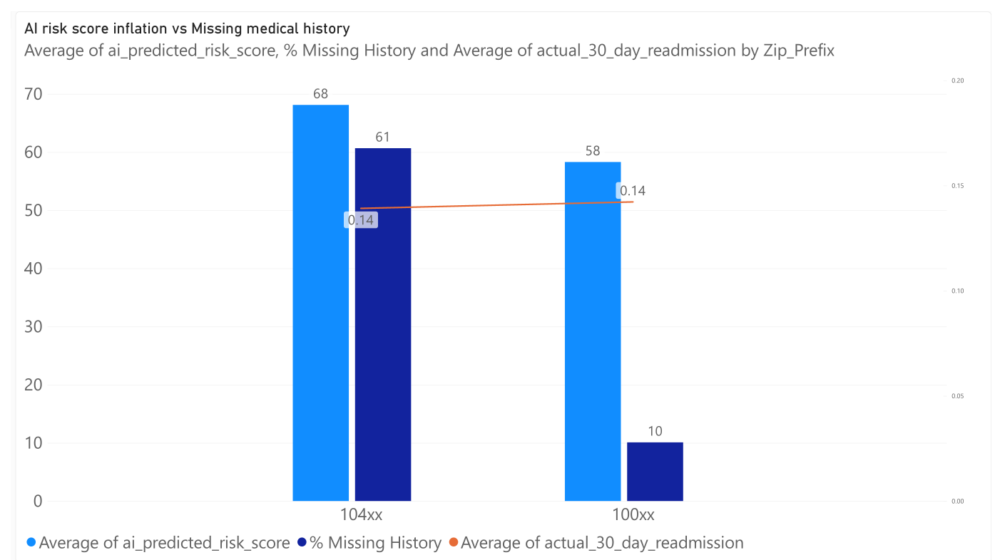

# EU AI Act (Article 10) Data Bias Audit: Clinical Triage System

## Executive Summary
This project demonstrates a practical, end-to-end data governance audit aligned with the **EU AI Act Article 10 (Data and Data Governance)**. 

Using a synthetic, controlled dataset of 5,000 clinical triage records, I conducted a bias audit using SQL and Power BI to identify structural non-compliance that would prevent a High-Risk clinical AI model from being legally deployed in the European Union.

## The Findings

The audit successfully identified and quantified three injected bias vectors:

1. **Geriatric Exclusion (Article 10(3) & 10(2)(h)):** 
   - **Finding:** 27.00% of records in the Geriatrics department were missing patient age, with 100% of the missing data clustered in patients aged 70+.
   - **Impact:** The model would perform worst on the vulnerable population with the highest real-world readmission risk.

2. **Female Pain Down-Coding (Article 10(2)(f) & 10(2)(g)):**
   - **Finding:** 56.40% of female patients reporting moderate-to-severe pain had their recorded EMR score down-coded by 2 to 3 points. Male reporting was 100% faithful.
   - **Impact:** Systematic under-triaging of acute female conditions, leading to prohibited sex-based discrimination and adverse health outcomes.

3. **Geographical/Socioeconomic Proxy Discrimination (Article 10(4) & 10(2)(f)):**
   - **Finding:** Lower-income zip codes (104xx) had a 60.68% missing medical history rate vs. 10.09% for affluent codes (100xx). The algorithm penalized missing history with a +20 point risk score, artificially inflating lower-income risk scores to 68.12 (vs 58.31) despite identical ground-truth readmission rates (~14%).
   - **Impact:** Socioeconomic redlining embedded silently into a readmission predictor via proxy variables.

## Repository Contents

- `/data`: Contains the `triage_dataset_raw.csv` (synthetic data generated for this audit).
- `/sql`: The `Audit_SM_SQL.sql` script containing the exact queries used to detect the biases.
- `/docs`: Contains the formal [Remediation Report Memo](docs/Remediation_Report.md) addressed to leadership.
- `/visuals`: Power BI dashboard exports visualizing the bias deltas.

## Methodology

This audit followed the **Obermeyer Protocol** framework:
1. **Feature Correlation:** Identifying variables linked to protected classes (e.g., zip code to socioeconomic status).
2. **Model Penalty:** Auditing how the algorithm treats those variables (e.g., penalizing missing history).
3. **Ground-Truth Parity:** Comparing the algorithm's output against the actual clinical outcome (30-day readmissions) to prove the penalty is discriminatory, not clinical.

## Technologies Used
- **SQL (MySQL):** Data aggregation, bias detection, and statistical delta calculation.
- **Power BI:** Visualizing risk inflation, missingness clustering, and down-coding deltas.
- **Python (Pandas):** Initial generation of the synthetic controlled dataset.
